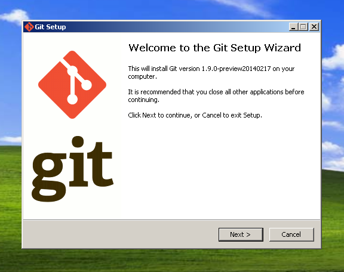
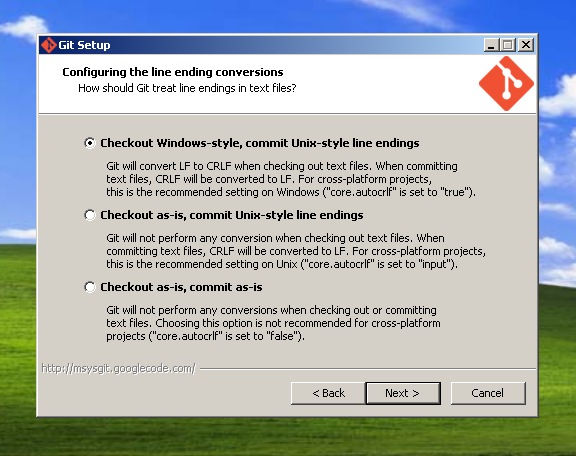

##Instalar git

###En Linux

Instalar git en linux es tan simple como usar tu gestor de paquetes favorito. Por ejemplo (recuerda que normalmente necesitarás privilegios de *root* para instalar cualquier programa):

####En Arch Linux
`# pacman -S git`

####En sistemas Debian, Ubuntu, Mint...
`# apt-get install git`

####En Gentoo
`# emerge --ask --verbose dev-vcs/git`

####En sistemas Red Hat, Fedora:
`# yum install git`

###En Windows

Para instalar git en Windows debe descargar el programa instalador en su web oficial en [http://git-scm.com/downloads](http://git-scm.com/downloads).

Una vez descargado, sólo tenemos que ejecutarlo y se abrirá una ventana que nos irá solicitando paso a paso los datos necesarios para la instalación. Pulsaremos el botón "Netx" para comenzar.

Nos pasará a la página de licencia (*es una licencia libre que permite copiar, modificar y distribuir el programa*).

La siguiente es una ventana que nos permite elegir el lugar de instalación. Si no tenemos especial interés en que sea otro, el que viene por defecto está bien. 

En la siguiente, podemos elegir una serie de cosas como el que aparezcan iconos de git en Inicio Rápido y el Escritorio o tener dos nuevas órdenes en el menú contextual (*el que aparece al hacer clic derecho con el ratón en una ventana*) para iniciar una ventana de git en es carpeta.

En la siguiente ventana se nos permite cambiar el nombre del grupo de programas que aparecerá en el menú Inicio

Las siguientes dos opciones configuran aspectos avanzados de 'git', concretamente el uso del prompt y el manejo de retornos de carro. Para un usuario novel son adecuadas las opciones por defecto.

Y, por fin, hemos finalizado nuestra instalación.

A partir de este momento, podemos ir al menú inicio como se indica en la imagen, y ejecutar "Git Bash", lo que abrirá una consola donde podremos interactuar con 'git' tal como se ve en este curso.

(*Al terminar todos estos pasos, y como se ven en la imagen, también se instalará una versión gráfica "Git GUI", pero en este curso se seguirá la interfaz de línea de comandos*)

###En Mac
Hay dos maneras de instalar Git en Mac, la más fácil es utilizar el instalador gráfico:

[Git for OS X](https://code.google.com/p/git-osx-installer/) 

##Clientes GUI para Linux, Windows y Mac

En este curso se seguirá la interfaz de *línea de comandos* (o *línea de órdenes*), pero existen varias aplicaciones para diversos sistemas operativos que permiten interactuar gráficamente (*Interfaz GUI*) con `git` de forma más o menos completa.

[GUI Mac](http://mac.github.com/)

[GUI Windows](http://windows.github.com/)

[GUI for Linux, Windows y Mac](http://git-scm.com/downloads/guis#"Guis clients")

##Abrir una cuenta en Github

Más adelante en este curso se hablará de Github y se darán detalles sobre su uso pero, por ahora, será suficiente para nosotros con saber abrir una cuenta (que usaremos para enviar nuestros ejercicios).

Desde la propia [página principal de la web de GitHub](https://github.com/) y como cualquier otro registro, se nos solicitan sólo tres datos: nombre o nick, e-mail y contraseña:

##Empezando a usar git

###Configurar

Lo primero que hay que hacer antes de empezar a usar git es configurar un par de parámetros básicos que nos identifican como usuario, que son nuestro correo electrónico y nuestro nombre.

Git usará estos datos para identificar nuestros aportes o modificaciones a la hora de mostrarlos en logs etc.

Configurar estos parámetros es muy fácil. Desde la línea de comandos escribimos las siguientes órdenes:

`git config --global user.name "Nombre que quieras mostrar"`

y

`git config --global user.email "correo@electroni.com"`

¿qué acabamos de hacer? Veamoslo, paso a paso:

Todos los comandos de git empiezan con la palabra `git`.

En este caso, el comando en sí mismo es `config`, que sirve para configurar varias opciones de git, en el primer caso `user.name` y en el segundo `user.email`.

Habrás notado que hay un parámetro `--global` en cada uno de los comandos. Este sirve para decirle a git que esos datos se aplican a todos los repositorios que abras.

Si quieres que algún repositorio concreto use unos datos distintos, puedes llamar al mismo comando, desde el directorio de ese repositorio, pero usando el parámetro `--local` en lugar de `--global`.

Hay más opciones que se pueden configurar, puedes verlas (y ver los valores que tienen) con el comando:

`git config --list`

Si te has equivocado al escribir alguno de estos datos o quieres cambiarlo, sólo tienes que volver a ejecutar el comando correspondiente de nuevo, y sobrescribirá los datos anteriores.

###Iniciando un repositorio

Un repositorio de git no es más que un directorio de nuestro ordenador que está bajo el control de git. En la práctica, esto significa que en el directorio raíz de nuestro proyecto hay otro directivo oculto llamado ".git" donde se guardan los archivos para el control de historiales, cambios, etc.

Para iniciar un repositorio sólo hay que situarse en el directorio de nuestro proyecto (el que contiene o va a contener los archivos que queremos controlar) y ejecutar la siguiente orden:

`git init`

Si todo va bien, este comando responderá algo parecido a "Initialized empty Git repository in /ruta/a/mi/proyecto/.git/", que significa que ya tienes creado tu primer repositorio. Vacío, pero por algo hay que empezar.

###Clonando un repositorio

Un repositorio también puede iniciarse copiando (*clonando*) otro ya existente.

`git clone REPOSITORIO`

por ejemplo:

`git clone https://github.com/oslugr/repo-ejemplo.git`

Git usa su propio protocolo "git" para el acceso remoto (también se puede clonar un repositorio local, simplemente indicando el path), pero también soporta otros protocolos como ssh, http, https...

Al contrario que con `git init`, con `git clone` no es necesario crear un directorio para el proyecto. Al clonar se creará un directorio con el nombre del proyecto dentro del que te encuentres al llamar a la orden.

Clonar un repositorio significa copiarlo completamente. No sólo los archivos, sino todo su historial, cambios realizados, etc. Es decir que en tu repositorio local tendrás exactamente lo mismo que había en el repositorio remoto de donde lo has clonado.

Si has clonado el repositorio del ejemplo anterior (y si no, hazlo ahora), podemos ver un par de cosas interesantes. ¿Recuerdas las orden `git config --list`? Entra en el directorio del repositorio (para ello tendrás que hacer algo como `cd repo-ejemplo/`) y lista las opciones de configuración.

Verás, entre otras muchas, las user.name y user.email que ya conoces. Pero hay otra que es importante, y es `remote.origin.url`, que debe contener la dirección original del repositorio del que has clonado el tuyo.

Ahora mismo no nos sirve de mucho pero, cuando más adelante trabajemos en red con otros repositorios, nos va a venir bien recordarlo.

###¿Cómo funciona git?

Antes de continuar, vamos a detenernos un momento para entender el funcionamiento de git.

Cuando trabajas con git lo haces, evidentemente, en un directorio donde tienes tus archivos, los modificas, los borras, creas nuevos, etc.

Ese directorio es lo que llamamos "Directorio de trabajo", puede contener otros directorios y, de hecho es el que contiene el directorio .git del que hablábamos al principio.

Git sabe que tiene que controlar ese directorio, pero no lo hace hasta que se lo digas expresamente.

Más adelante veremos con algo más de detalle la orden `git add`, pero ya te adelanto que lo que hace es preparar los archivos que le indiques poniéndolos en una especie de lista virtual a la que llamamos el "Index". En Index ponerlos los archivos que hemos ido modificando, pero ls cosas que están en el "Index" aun no han sido archivadas por git.

Ojo, que algo esté en el index no significa que se borre de tu directorio de trabajo ni nada parecido, el Index es sólo una lista de cosas que tendrás que actualizar en el repositorio porque han cambiado.

Por último, la instrucción `git commit`, que también veremos en breve, es la que realmente envía las cosas que hay en el Index al repositorio. Solo que, en lugar de "repositorio" lo vamos a llamar "HEAD", porque el lugar exacto al que va puede significar cosas distintas en según que casos, como ya veremos cuando hablemos de ramas y esas cosas.

Lo sé, es todo un poco lioso ahora mismo, pero ya se irá aclarando conforme aprendamos más cosas.

Tú sólo mantén esta secuencia en la cabeza: Directorio de trabajo -> Index -> HEAD

###Manteniendo nuestro repositorio al día

Tienes tu repositorio iniciado (o clonado) con una serie de archivos con los que empiezas a trabajar, creándolos, editándolos, modificándolos, etc.

Para que git sepa que tiene que empezar a tener en cuenta un archivo, usamos la orden `git add` de este modo:

`git add NOMBRE_DEL_ARCHIVO`

Esto, como vimos antes, añadirá el archivo indicado con `NOMBRE_DEL_ARCHIVO` al Index. No lo archivará realmente en el sistema de control de versiones ni hará nada. Sólo le informa de que debe tener en cuenta ese archivo para futuras instrucciones (que es, básicamente, en lo que consiste el Index).

Si intentas añadir al Index un archivo que no existe te dará un error.

También puedes usar *comodines*, con cosas como:

`git add miarchivo.*`

(que reconocería, por ejemplo "miarchivo.txt", "miarchivo.cosas" y "miarchivo.png")

o 

`git add miarchivo$.txt`

(que identificaría cosas como "miarchivo1.txt", "miarchivo2.txt" y "miarchivoZ.txt")

Y, en general, todos los comodines que permita usar tu sistema operativo.

Si, en lugar de un archivo, indicas un directorio, se agregarán al Index todos los archivos de ese directorio.

De este modo, la forma más fácil de agregar todos los archivos al Index es mediante la orden:

`git add .`

Un detalle importante es que, si mandas algo al Index con `git add` y luego lo modificas, no tendrás en Index la última versión, si no lo que hayas hecho hasta el momento del hacer el add.

Esto es muy útil (a veces tienes que hacer cambios que aún no quieres "archivar") pero puede llevarte a alguna confusión.

Ahora vamos a ver una orden que será tu gran amiga:

`git status`

`git status` te da un resumen de cómo están las cosas ahora mismo respecto a la versión del repositorio (concretamente, respecto al HEAD). Qué archivos has modificado, que hay en el Index, etc (también te cuenta cosas como en qué rama estás, pero eso lo veremos más adelante). Cada vez que no tengas muy claro que has cambiado y qué no, consulta `git status`.

Además, y esa es una cosa que vas a ver a menudo en git, te informa de posibles acciones que puedes llevar a cabo dependiendo de las circunstancias actuales diciendo como, por ejemplo, *(use "git add <file>..." to update what will be committed)*".

Commit. Add. Push. Pull.

