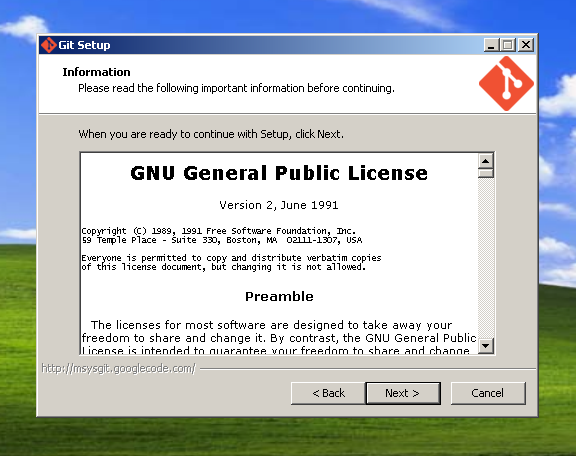
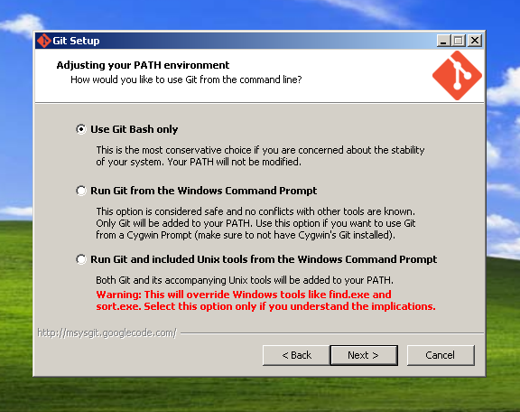
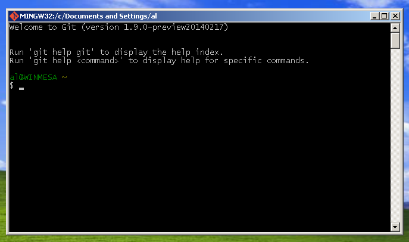

##Instalar git

###En Linux

Instalar git en linux es tan simple como usar tu gestor de paquetes favorito. Por ejemplo:

####En Arch Linux
`$ pacman -S git`

####En sistemas Debian, Ubuntu, Mint...
`$ sudo apt-get install git`

####En Gentoo
`$ emerge --ask --verbose dev-vcs/git`

####En sistemas Red Hat, Fedora:
`$ yum install git`

###En Windows

Para instalar git en Windows debe descargar el programa instalador en su web oficial en [http://git-scm.com/downloads](http://git-scm.com/downloads).

Una vez descargado, sólo tenemos que ejecutarlo y se abrirá una ventana que nos irá solicitando paso a paso los datos necesarios para la instalación. Pulsaremos el botón "Netx" para comenzar.

Nos pasará a la página de licencia (*es una licencia libre que permite copiar, modificar y distribuir el programa*).

La siguiente es una ventana que nos permite elegir el lugar de instalación. Si no tenemos espeial interés en que sea otro, el que viene por defecto está bien. 

En la sugiente, podemos elegir una serie de cosas como el que aparezcan iconos de git en Inicio Rápido y el Escritorio o tener dos nuevas órdenes en el menú contenxtual (*el que aparece al hacer clic derecho con el ratón en una ventana*) para inicar una ventana de git en es carpeta.

En la siguiente ventana se nos permite cambiar el nombre del grupo de programas que aparecerá en el menú Inicio

Las siguientes dos opciones configuran aspectos avanzados de 'git', concretamenete el uso del prompt y el manejo de retornos de carro. Para un usuario novel son adecuadas las opciones por defecto.

Y, por fín, hemos finalizado nuestra instalación.

A partir de este momento, podemos ir al menú inicio como se indica en la imagen, y ejecutar "Git Bash", lo que abrirá una consola donde podremos interactuar con 'git' tal como se ve en este curso.

(*Al terminar todos estos pasos, y como se ven en la imagen, también se instalará una versión gráfica "Git GUI", pero en este curso se seguirá la interfaz de línea de comandos*)

###En Mac
Hay dos maneras de instalar Git en Mac, la más fácil es utilizar el instalador gráfico:

[Git for OS X](https://code.google.com/p/git-osx-installer/) 

##Clientes GUI para Linux, Windows y Mac

En este curso se seguirá la interfaz de *línea de comandos* (o *línea de órdenes*), pero existen varias aplicaciones para diversos sistemas operativos que permiten interactuar gráficamente (*Interfaz GUI*) con `git` de forma más o menos completa.

[GUI Mac](http://mac.github.com/)

[GUI Windows](http://windows.github.com/)

[GUI for Linux, Windows y Mac](http://git-scm.com/downloads/guis#"Guis clients")

##Abrir una cuenta en Github

Más adelante en este curso se hablará de Github y se darán detalles sobre su uso pero, por ahora, será suficiente para nosotros con saber abrir una cuenta (que usaremos para enviar nuestros ejercicios).

Desde la propia [página principal de la web de GitHub](https://github.com/) y como cualquier otro registro, se nos solicitan sólo tres datos: nombre o nick, e-mail y contraseña:

##Empezando a usar git

###Configurar

Lo primero que hay que hacer antes de empezar a usar git es configurar un par de parámetros básicos que nos identifican como usuario, que son nuestro correo electrónico y nuestro nombre.

Git usará estos datos para identificar nuestros aportes o modificaciones a la hora de mostrarlos en logs etc.

Configurar estos parámetros es muy fácil. Desde la línea de comandos escribimos las siguientes órdenes:

`git config --global user.name "Nombre que quieras mostrar"`

y

`git config --global user.email "correo@electroni.com"`

¿qué acabamos de hacer? Veamoslo, paso a paso:

Todos los comandos de git empienzan con la palabra `git`.

En este caso, el comando en sí mismo es `config`, que sirve para configurar varias opciones de git, en el primer caso `user.name` y en el segundo `user.email`.

Habrás notado que hay un parámetro `--global` en cada uno de los comandos. Este sirve para decirle a git que esos datos se aplican a todos los repositorios que abras.

Si quieres que algún repositorio concreto use unos datos distintos, puedes llamar al mismo comando, desde el directorio de ese repositorio, pero usando el parámtro `--local` en lugar de `--global`.

Hay más opciones que se pueden configurar, puedes verlas (y ver los valores que tienen) con el comando:

`git config --list`

Si te has equivocado al escribir alguno de estos datos o quieres cambiarlo, sólo tienes que volver a ejecutar el comando correspondiente de nuevo, y sobrescribirá los datos anteriores.

###Iniciando un repositorio

Un repositrio de git no es más que un directorio de nuestro ordenador que está bajo el control de git. En la práctia, esto significa que en el directorio raiz de nuestro proyecto hay otro directiro oculto llamado ".git" donde se guardan los archivos para el control de historiales, cambios, etc.

Para inicar un repositorio sólo hay que situarse en el directorio de nuestro proyecto (el que contiene o va a contener los archivos que queremos controlar) y ejecutar la siguiente orden:

`git init`

Si todo va bien, este comando responderá algo parecido a "Initialized empty Git repository in /ruta/a/mi/proyecto/.git/", que significa que ya tienes creado tu primer repositorio. Vacío, pero por algo hay que empezar.

Un repositorio también puede iniciarse copaindo (*clonando*) otro ya existente.

Clonación de un repositorio, Commit. Add. Push. Pull. Creación de un repo en una web y localmente

Un repositrio de git no es más que un directorio de nuestro ordenador que está bajo el control de `git`. En la práctia, esto significa que en nuestro directorio hay otro directiro oculto llamado ".git" donde se guardan los archivos de git.

